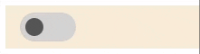

# toggle-switch component


This is a toggle-switch component: a switch having ON & OFF states. It is a standard custom web component written in pure vanilla JS, so it could be used in any framework.

> With the package you will find a complete functional **example.html**<br>
> Note that, as a developer, you need not to take any action to control the switch itself, it works automatically as expected.

## Usage:
Use it like any standard tag:
- In html: `<toggle-switch></toggle-switch>`
- In JS: `document.createElement("toggle-switch")`

## Attributes:
- `disabled`: if present `<toggle-switch disabled></toggle-switch>`, the switch will be disabled: meaning it will not respond to user actions. Please note that a disabled switch could be in ON or OFF state.

## Properties:
- `state`: it is a boolean property of a JS object representing a `toggle-switch` tag. This property does not have a corresponding attribute. It is a read/write property. `true` value indicates the ON state of the switch, and `false` value indicates the OFF state of the switch.

## Events:
- `toggle-switch-changed`: This event enables developers to take actions when a user changes the state of the switch. To learn about the switch's new state after the user changed it, you should read `event.detail` or the switch's `state` property. It's value indicates the final state of the switch.
   ```js
   document.querySelector("toggle-switch")
      .addEventListener("toggle-switch-clicked", e => { console.log(e.detail); });
   ```

## Styling:
1. Define in an element's selector block one or more of the following custom properties:
   - `--block-size`: this controls the block-size (height) of the component (not including the borders). Default is 14px. Note that the inline-size is calculated internally from the block-size as `inline-size = 2 * block-size`.
   - `--bg-off-color`: switch's background-color when in the OFF state. Default is `white`.
   - `--bg-on-color`: switch's background-color when in the ON state. Default is `blue`.
   - `--slider-off-color`: slider's color when in the OFF state. Default is `black`.
   - `--slider-on-color`: slider's color when in the ON state. Default is `white`.
   - `--border-color`: switch's border color. Default is `#ccc`.
   ```css
   toggle-switch { 
      --block-size: 30px;
      --bg-off-color: lightgrey;
   }
   ```

2. Or you can reach the following parts of the component:
   - `::part(container)`: the container is actually a `div` element, so style it as you style any `div` element.
   - `::part(slider)`: the slider inside the container. It is actually a `div` element, so style it as you style any `div` element.
   ```css
   ::part(slider) { background-color: lightgray; }
   ```
